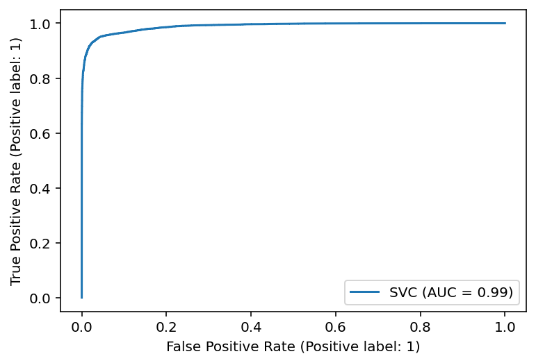

 # Airline passenger satisfacion 
---

<a id='about_dataset'></a> 
## About Dataset
### Context
This dataset contains an airline passenger satisfaction survey. What factors are highly correlated to a satisfied (or dissatisfied) passenger? Can you predict passenger satisfaction?

---
### Content
Gender: Gender of the passengers (Female, Male)

Customer Type: The customer type (Loyal customer, disloyal customer)

Age: The actual age of the passengers

Type of Travel: Purpose of the flight of the passengers (Personal Travel, Business Travel)

Class: Travel class in the plane of the passengers (Business, Eco, Eco Plus)

Flight distance: The flight distance of this journey

Inflight wifi service: Satisfaction level of the inflight wifi service (0:Not Applicable;1-5)

Departure/Arrival time convenient: Satisfaction level of Departure/Arrival time convenient

Ease of Online booking: Satisfaction level of online booking

Gate location: Satisfaction level of Gate location

Food and drink: Satisfaction level of Food and drink

Online boarding: Satisfaction level of online boarding

Seat comfort: Satisfaction level of Seat comfort

Inflight entertainment: Satisfaction level of inflight entertainment

On-board service: Satisfaction level of On-board service

Leg room service: Satisfaction level of Leg room service

Baggage handling: Satisfaction level of baggage handling

Check-in service: Satisfaction level of Check-in service

Inflight service: Satisfaction level of inflight service

Cleanliness: Satisfaction level of Cleanliness

Departure Delay in Minutes: Minutes delayed when departure

Arrival Delay in Minutes: Minutes delayed when Arrival

Satisfaction: Airline satisfaction level(Satisfaction, neutral or dissatisfaction)

Note that this data set was modified from this dataset by John D here. It has been cleaned up for the purposes of classification.

---

<a id='goal'></a>
## Goal
#### This jupyter notebook aiming for 3 major parts.
1. Data visualization
2. Machine learning
3. Deep learning Tensorfow
---

<a id='index'></a>
## Index
- [About Dataset](#about_dataset)
- [Goal](#goal)
- [Import relative libraries](#import_relative_libraries)
- [Importing data](#importing_data)
- [Cleaning data and data imputing](#cleaning_data_and_data_imputing)
- #### [Data visualization](#data_visualization)
- [Data preprocessing](#data_preprocessing)
- #### [Machine learing](#machine-learning)
    - [Model compile function](#model_compile_function)
    - [Testing Models](#testing_models)
        - [LogisticRegression](#logistic_regression)
        - [Decision Tree](#decision_tree)
        - [Random Forest](#random_forest)
        - [KNearest Neighbors](#kneighbors)
        - [Naive Bayes](#naive_bayes)
        - [Stochastic Gradient Desent](#SGD)
        - [Support Vector Machine](#support_vector_machine)
    - [Analyst models performance](#analyst_models_performance)
- #### [Tensorflow](#tensorflow)
    - [Data preprocessing](#data_preprocessing_tf)
    - [Loading Data](#loading_data)
    - [Data](#data)
    - [Model](#model)
    - [Test Model](#test_model)
---

<a id='import_relative_libraries'></a>
### Import Relative Libraries


```python
import time
import pandas as pd
import numpy as np
import matplotlib.pyplot as plt
import seaborn as sns
from sklearn.preprocessing import StandardScaler
from sklearn.linear_model import LogisticRegression, SGDClassifier
from sklearn.tree import DecisionTreeClassifier
from sklearn.ensemble import RandomForestClassifier
from sklearn.neighbors import KNeighborsClassifier
from sklearn.naive_bayes import GaussianNB
from sklearn.metrics import roc_auc_score, plot_roc_curve, plot_confusion_matrix
from sklearn import svm

pd.set_option('display.max_rows', 500)
pd.set_option('display.max_columns', 500)
pd.set_option('display.width', 1000)

import matplotlib as mpl
mpl.rc('image', cmap='gray')

%config InlineBackend.figure_format = 'retina'

```

<a id='importing_data'></a>
## Importing Data


```python
train = pd.read_csv('train.csv')
test = pd.read_csv('test.csv')
```


```python
train.info()
```

    <class 'pandas.core.frame.DataFrame'>
    RangeIndex: 103904 entries, 0 to 103903
    Data columns (total 25 columns):
     #   Column                             Non-Null Count   Dtype  
    ---  ------                             --------------   -----  
     0   Unnamed: 0                         103904 non-null  int64  
     1   id                                 103904 non-null  int64  
     2   Gender                             103904 non-null  object 
     3   Customer Type                      103904 non-null  object 
     4   Age                                103904 non-null  int64  
     5   Type of Travel                     103904 non-null  object 
     6   Class                              103904 non-null  object 
     7   Flight Distance                    103904 non-null  int64  
     8   Inflight wifi service              103904 non-null  int64  
     9   Departure/Arrival time convenient  103904 non-null  int64  
     10  Ease of Online booking             103904 non-null  int64  
     11  Gate location                      103904 non-null  int64  
     12  Food and drink                     103904 non-null  int64  
     13  Online boarding                    103904 non-null  int64  
     14  Seat comfort                       103904 non-null  int64  
     15  Inflight entertainment             103904 non-null  int64  
     16  On-board service                   103904 non-null  int64  
     17  Leg room service                   103904 non-null  int64  
     18  Baggage handling                   103904 non-null  int64  
     19  Checkin service                    103904 non-null  int64  
     20  Inflight service                   103904 non-null  int64  
     21  Cleanliness                        103904 non-null  int64  
     22  Departure Delay in Minutes         103904 non-null  int64  
     23  Arrival Delay in Minutes           103594 non-null  float64
     24  satisfaction                       103904 non-null  object 
    dtypes: float64(1), int64(19), object(5)
    memory usage: 19.8+ MB
    


```python
train.head()
```


<div>
<style scoped>
    .dataframe tbody tr th:only-of-type {
        vertical-align: middle;
    }

    .dataframe tbody tr th {
        vertical-align: top;
    }

    .dataframe thead th {
        text-align: right;
    }
</style>
<table border="1" class="dataframe">
  <thead>
    <tr style="text-align: right;">
      <th></th>
      <th>Unnamed: 0</th>
      <th>id</th>
      <th>Gender</th>
      <th>Customer Type</th>
      <th>Age</th>
      <th>Type of Travel</th>
      <th>Class</th>
      <th>Flight Distance</th>
      <th>Inflight wifi service</th>
      <th>Departure/Arrival time convenient</th>
      <th>Ease of Online booking</th>
      <th>Gate location</th>
      <th>Food and drink</th>
      <th>Online boarding</th>
      <th>Seat comfort</th>
      <th>Inflight entertainment</th>
      <th>On-board service</th>
      <th>Leg room service</th>
      <th>Baggage handling</th>
      <th>Checkin service</th>
      <th>Inflight service</th>
      <th>Cleanliness</th>
      <th>Departure Delay in Minutes</th>
      <th>Arrival Delay in Minutes</th>
      <th>satisfaction</th>
    </tr>
  </thead>
  <tbody>
    <tr>
      <th>0</th>
      <td>0</td>
      <td>70172</td>
      <td>Male</td>
      <td>Loyal Customer</td>
      <td>13</td>
      <td>Personal Travel</td>
      <td>Eco Plus</td>
      <td>460</td>
      <td>3</td>
      <td>4</td>
      <td>3</td>
      <td>1</td>
      <td>5</td>
      <td>3</td>
      <td>5</td>
      <td>5</td>
      <td>4</td>
      <td>3</td>
      <td>4</td>
      <td>4</td>
      <td>5</td>
      <td>5</td>
      <td>25</td>
      <td>18.0</td>
      <td>neutral or dissatisfied</td>
    </tr>
    <tr>
      <th>1</th>
      <td>1</td>
      <td>5047</td>
      <td>Male</td>
      <td>disloyal Customer</td>
      <td>25</td>
      <td>Business travel</td>
      <td>Business</td>
      <td>235</td>
      <td>3</td>
      <td>2</td>
      <td>3</td>
      <td>3</td>
      <td>1</td>
      <td>3</td>
      <td>1</td>
      <td>1</td>
      <td>1</td>
      <td>5</td>
      <td>3</td>
      <td>1</td>
      <td>4</td>
      <td>1</td>
      <td>1</td>
      <td>6.0</td>
      <td>neutral or dissatisfied</td>
    </tr>
    <tr>
      <th>2</th>
      <td>2</td>
      <td>110028</td>
      <td>Female</td>
      <td>Loyal Customer</td>
      <td>26</td>
      <td>Business travel</td>
      <td>Business</td>
      <td>1142</td>
      <td>2</td>
      <td>2</td>
      <td>2</td>
      <td>2</td>
      <td>5</td>
      <td>5</td>
      <td>5</td>
      <td>5</td>
      <td>4</td>
      <td>3</td>
      <td>4</td>
      <td>4</td>
      <td>4</td>
      <td>5</td>
      <td>0</td>
      <td>0.0</td>
      <td>satisfied</td>
    </tr>
    <tr>
      <th>3</th>
      <td>3</td>
      <td>24026</td>
      <td>Female</td>
      <td>Loyal Customer</td>
      <td>25</td>
      <td>Business travel</td>
      <td>Business</td>
      <td>562</td>
      <td>2</td>
      <td>5</td>
      <td>5</td>
      <td>5</td>
      <td>2</td>
      <td>2</td>
      <td>2</td>
      <td>2</td>
      <td>2</td>
      <td>5</td>
      <td>3</td>
      <td>1</td>
      <td>4</td>
      <td>2</td>
      <td>11</td>
      <td>9.0</td>
      <td>neutral or dissatisfied</td>
    </tr>
    <tr>
      <th>4</th>
      <td>4</td>
      <td>119299</td>
      <td>Male</td>
      <td>Loyal Customer</td>
      <td>61</td>
      <td>Business travel</td>
      <td>Business</td>
      <td>214</td>
      <td>3</td>
      <td>3</td>
      <td>3</td>
      <td>3</td>
      <td>4</td>
      <td>5</td>
      <td>5</td>
      <td>3</td>
      <td>3</td>
      <td>4</td>
      <td>4</td>
      <td>3</td>
      <td>3</td>
      <td>3</td>
      <td>0</td>
      <td>0.0</td>
      <td>satisfied</td>
    </tr>
  </tbody>
</table>
</div>


#### Let's looking into the data here what we noticed: 
- Our *targat* is *'satisfaction'*
- Columns *'Unamed', 'id'* are neglectable since it on effect the *'satisfaction'*
- The data are not sort by any value, so no nedd to shuffle
- There are a lot of columns data type is *category*, encoding are require.

---

<a id='cleaning_data_and_data_imputing'></a>
## Cleaning Data and Data Imputing

Find **missing** values in dataset


```python
print(pd.DataFrame({'Missing Value Train':train.isna().sum(),
                    'Missing Value Test':test.isna().sum() }))
```

                                       Missing Value Train  Missing Value Test
    Unnamed: 0                                           0                   0
    id                                                   0                   0
    Gender                                               0                   0
    Customer Type                                        0                   0
    Age                                                  0                   0
    Type of Travel                                       0                   0
    Class                                                0                   0
    Flight Distance                                      0                   0
    Inflight wifi service                                0                   0
    Departure/Arrival time convenient                    0                   0
    Ease of Online booking                               0                   0
    Gate location                                        0                   0
    Food and drink                                       0                   0
    Online boarding                                      0                   0
    Seat comfort                                         0                   0
    Inflight entertainment                               0                   0
    On-board service                                     0                   0
    Leg room service                                     0                   0
    Baggage handling                                     0                   0
    Checkin service                                      0                   0
    Inflight service                                     0                   0
    Cleanliness                                          0                   0
    Departure Delay in Minutes                           0                   0
    Arrival Delay in Minutes                           310                  83
    satisfaction                                         0                   0
    

**Arrival Delay in Minutes** are have missing value, let's looking into data.

---


```python
print(train.describe()['Arrival Delay in Minutes'],
      test.describe()['Arrival Delay in Minutes'])
```

    count    103594.000000
    mean         15.178678
    std          38.698682
    min           0.000000
    25%           0.000000
    50%           0.000000
    75%          13.000000
    max        1584.000000
    Name: Arrival Delay in Minutes, dtype: float64 count    25893.000000
    mean        14.740857
    std         37.517539
    min          0.000000
    25%          0.000000
    50%          0.000000
    75%         13.000000
    max       1115.000000
    Name: Arrival Delay in Minutes, dtype: float64
    


```python
plt.hist(train['Arrival Delay in Minutes']);
```


    

    


The distribution is extremely Right-skew. Missing values are filled with **median** 

---


```python
def clean_data(df):
    # Since Unnamed: 0 and id columns are not significant so we drop it
    df = df.drop(['Unnamed: 0', 'id'], axis=1)
    
    # The columns content 'white space' that might lead to error, so ' ' are replace with '_'
    df.columns = [x.replace(' ','_').lower() for x in df.columns]
    
   # Fill na values in column 'Arrival Delay in Minutes' with Median
    df['arrival_delay_in_minutes'] = df['arrival_delay_in_minutes'].fillna(df['arrival_delay_in_minutes'].median())
    
    return df

train_cleaned = clean_data(train)
test_cleaned = clean_data(test)
```

<a id='data_visualization'></a>
## Data visualization

Separate *features* columns and *target* columns


```python
features = ['gender', 'customer_type', 'age', 'type_of_travel', 'class',
       'flight_distance', 'inflight_wifi_service',
       'departure/arrival_time_convenient', 'ease_of_online_booking',
       'gate_location', 'food_and_drink', 'online_boarding', 'seat_comfort',
       'inflight_entertainment', 'on-board_service', 'leg_room_service',
       'baggage_handling', 'checkin_service', 'inflight_service',
       'cleanliness', 'departure_delay_in_minutes', 'arrival_delay_in_minutes']
target = ['satisfaction']
```

### Ratio of categorical features
Let's see how balance of dataset we have.


```python
category = ['satisfaction', 'gender', 'customer_type', 'class', 'type_of_travel'] 
nrows = 2
ncols = 3
colors = sns.color_palette("pastel")

fig, axs = plt.subplots(nrows=nrows, ncols=ncols, figsize=(15,8))

for c, v in enumerate(category):
    df = train_cleaned.copy()
    data = df[category[c]].value_counts().sort_values(ascending=False)
    labels = df[category[c]].unique().tolist()
    labels.sort(reverse=False)
    axs[c//ncols, c%ncols].pie(x=data,
            labels=labels,
            colors=colors,
            autopct='%1.1f%%',
            startangle=90)
    axs[c//ncols, c%ncols].set_title(v)

fig.delaxes(axs[1,2]) # remove axes

plt.subplots_adjust(left=0.125,
                    right=.9, 
                    wspace=0.2)
```


    

    


#### The pie charts above telling us.
- The majority of customer are likely to neutral or dissatisfied
- Number of male and female sample are nearly same.
- Most of customer are regular customer
- Nearly half of customer chose business class.
- More than flight taken are for business purpose.

---


```python
nrows = 5
ncols = 3
figsize = (15,20)
colors = sns.color_palette("Pastel2")


surveys = ['inflight_wifi_service',
       'departure/arrival_time_convenient', 'ease_of_online_booking',
       'gate_location', 'food_and_drink', 'online_boarding', 'seat_comfort',
       'inflight_entertainment', 'on-board_service', 'leg_room_service',
       'baggage_handling', 'checkin_service', 'inflight_service',
       'cleanliness']

fig , axs = plt.subplots(nrows=nrows, ncols=ncols, figsize=figsize)
for c, v in enumerate(surveys):
    df=train_cleaned.copy()
    data = df[surveys[c]].value_counts().sort_index(ascending=False)
    labels = df[surveys[c]].unique().tolist()
    labels.sort(reverse=True)

    axs[c//ncols,c%ncols].pie(x=data, labels=labels, colors=colors, autopct='%1.0f%%', startangle=90)
    axs[c//ncols,c%ncols].set_title(surveys[c])
    
fig.delaxes(axs[4,2])
```


    

    


#### The survey scorce display us:
- More than 60% of customer rated 4-5 with Bagage handlind and Inflight service.
- Less than 35% of customer rated 4-5 with Inflight wifi service and Ease of online booking.

---

### Satisfaction ratio of qualitative features


```python
nrows = 6
ncols = 3
figsize = (20,30)
palette = sns.color_palette('Set1')


qualitative_feature = ['gender', 'customer_type', 'type_of_travel', 'class','inflight_wifi_service',
       'departure/arrival_time_convenient', 'ease_of_online_booking',
       'gate_location', 'food_and_drink', 'online_boarding', 'seat_comfort',
       'inflight_entertainment', 'on-board_service', 'leg_room_service',
       'baggage_handling', 'checkin_service', 'inflight_service',
       'cleanliness']


fig, axs = plt.subplots(nrows=nrows, ncols=ncols, figsize=figsize)

for c, v in enumerate(qualitative_feature):
    sns.countplot(x=qualitative_feature[c], hue='satisfaction', data=train_cleaned, palette=palette, ax=axs[c//ncols, c%ncols])
    axs[c//ncols, c%ncols].set_title(v)

# Adjust subplt layout
plt.subplots_adjust(left=0.125,
                    bottom=0.125, 
                    right=0.9, 
                    top=0.9, 
                    wspace=0.4, 
                    hspace=0.4)
```


    

    


#### Some conclude about these plots reveal:
- The masses of *personal travel* customer receive bad experience.
- Majority of *eco* class feel dissatisfied.
- Mostly the survey show, if customer give 5 rating are likely to satisfied except *departure/arrival time convinent.*

---

#### Quantitative features


```python
quan_features = ['age', 'flight_distance', 'departure_delay_in_minutes', 'arrival_delay_in_minutes']

corr = train_cleaned[quan_features].corr()

# Generate a mask for the upper triangle
mask = np.triu(np.ones_like(corr, dtype=bool))

# Set up the matplotlib figure
f, ax = plt.subplots(figsize=(5,4))

# Generate a custom diverging colormap
cmap = sns.diverging_palette(230, 20, as_cmap=True)

# Draw the heatmap with the mask and correct aspect ratio
sns.heatmap(corr, mask=None, cmap=cmap, vmax=1, center=0,
            annot=True,
            square=True, linewidths=.5, cbar_kws={"shrink": .8})
```


    <AxesSubplot:>


    

    


- A high correlation between *Departure Delay in Minutes and Arrival Delay in Minutes*,
is crystal clear due to late depart  also affect arrival time as well.


```python
feature = 'age'
min_bin = 0
max_bin = 100
width = 10
bins = np.arange(min_bin, max_bin, width)


df = train_cleaned.copy()
df['satisfaction']=df['satisfaction'].map({'neutral or dissatisfied':0, 'satisfied':1})
df= df[(df[feature]>=df[feature].quantile(0.01)) &(df[feature]<=df[feature].quantile(.99))]
df[feature] = pd.cut(df[feature], bins=bins)
df1 = df.groupby(by=feature)['satisfaction'].sum()
df2 = df.groupby(by=feature)['satisfaction'].count()
y = (df1/df2).values
x = np.arange(min_bin+width/2, max_bin-width/2, width)


fig, ax1 = plt.subplots(figsize=(8,5))

ax1.set_title(f'Satisfaction Rate by {feature}', fontsize=13)

ax1.set_xlabel(feature, fontsize=13)
ax1.set_ylabel('Number of passenger', fontsize=13, color='tab:blue')
sns.histplot(train_cleaned[feature], bins=bins, color='thistle')
ax1.tick_params(axis='y')

ax2 = ax1.twinx()
color = 'tab:orange'
ax2.set_ylabel('Satisfaction rate', fontsize=13, color=color)
ax2 = sns.lineplot(x=x, y=y, data = None, sort=False, color=color)
ax2.tick_params(axis='y', color=color)

ax2.hlines(y=0.5, xmin=min_bin, xmax=max_bin, linestyles='dashed', color='tab:red')
```


    <matplotlib.collections.LineCollection at 0x1c5ef9d3ee0>


    

    


- More than half a people age between 40-60 years pleased with their travel.


```python
feature = 'flight_distance'
min_bin = 0
max_bin = 5000
width = 250
bins = np.arange(min_bin, max_bin, width)


df = train_cleaned.copy()
df['satisfaction']=df['satisfaction'].map({'neutral or dissatisfied':0, 'satisfied':1})
df= df[(df[feature]>=df[feature].quantile(0.01)) &
                  (df[feature]<=df[feature].quantile(0.99))]
df[feature] = pd.cut(df[feature], bins=bins)
df1 = df.groupby(by=feature)['satisfaction'].sum()
df2 = df.groupby(by=feature)['satisfaction'].count()
y = (df1/df2).values
x = np.arange(min_bin+width/2, max_bin-width/2, width)


fig, ax1 = plt.subplots(figsize=(10, 6))

ax1.set_title(f'Satisfaction Rate by {feature}', fontsize=13)

ax1.set_xlabel('Flight Distance', fontsize=13)
ax1.set_ylabel('Number of passenger', fontsize=13, color='tab:blue')
sns.histplot(train_cleaned['flight_distance'], bins=20, color='cornflowerblue')
ax1.tick_params(axis='y')

ax2 = ax1.twinx()
color = 'tab:orange'
ax2.set_ylabel('Satisfaction rate', fontsize=13, color=color)
ax2 = sns.lineplot(x=x, y=y, data = None, sort=False, color=color)
ax2.tick_params(axis='y', color=color)

ax2.hlines(y=0.5, xmin=min_bin, xmax=max_bin, linestyles='dashed', color='tab:red')
```


    <matplotlib.collections.LineCollection at 0x1c5ec808460>


    

    


- Considered plot show more distance of their flight give more happy they feel.


```python
feature = 'departure_delay_in_minutes'
min_bin = 0
max_bin = 100
width = 20
bins = np.arange(min_bin, max_bin, width)


df = train_cleaned.copy()
df['satisfaction']=df['satisfaction'].map({'neutral or dissatisfied':0, 'satisfied':1})
df= df[(df[feature]>=df[feature].quantile(0.01)) &(df[feature]<=df[feature].quantile(0.99))]
df[feature] = pd.cut(df[feature], bins=bins)
df1 = df.groupby(by=feature)['satisfaction'].sum()
df2 = df.groupby(by=feature)['satisfaction'].count()
y = (df1/df2).values
x = np.arange(min_bin+width/2, max_bin-width/2, width)


fig, ax1 = plt.subplots(figsize=(8,5))

ax1.set_title(f'Satisfaction Rate by {feature}', fontsize=13)

ax1.set_xlabel(feature, fontsize=13)
ax1.set_ylabel('Number of passenger', fontsize=13, color='tab:blue')
sns.histplot(train_cleaned[feature], bins=bins, color='cornflowerblue')
ax1.tick_params(axis='y')

ax2 = ax1.twinx()
color = 'tab:orange'
ax2.set_ylabel('Satisfaction rate', fontsize=13, color=color)
ax2 = sns.lineplot(x=x, y=y, data = None, sort=False, color=color)
ax2.tick_params(axis='y', color=color)
ax2.hlines(y=0.5, xmin=min_bin, xmax=max_bin, linestyles='dashed', color='tab:red')
```


    <matplotlib.collections.LineCollection at 0x1c5e5ad2c10>


    

    


```python
feature = 'arrival_delay_in_minutes'
min_bin = 0
max_bin = 100
width = 20
bins = np.arange(min_bin, max_bin, width)


df = train_cleaned.copy()
df['satisfaction']=df['satisfaction'].map({'neutral or dissatisfied':0, 'satisfied':1})
df= df[(df[feature]>=df[feature].quantile(0.01)) &(df[feature]<=df[feature].quantile(0.99))]
df[feature] = pd.cut(df[feature], bins=bins)
df1 = df.groupby(by=feature)['satisfaction'].sum()
df2 = df.groupby(by=feature)['satisfaction'].count()
y = (df1/df2).values
x = np.arange(min_bin+width/2, max_bin-width/2, width)


fig, ax1 = plt.subplots(figsize=(8,5))

ax1.set_title(f'Satisfaction Rate by {feature}', fontsize=13)

ax1.set_xlabel(feature, fontsize=13)
ax1.set_ylabel('Number of passenger', fontsize=13, color='tab:blue')
sns.histplot(train_cleaned[feature], bins=bins, color='lightcoral')
ax1.tick_params(axis='y')

ax2 = ax1.twinx()
color = 'tab:orange'
ax2.set_ylabel('Satisfaction rate', fontsize=13, color=color)
ax2 = sns.lineplot(x=x, y=y, data = None, sort=False, color=color)
ax2.tick_params(axis='y', color=color)
ax2.hlines(y=0.5, xmin=min_bin, xmax=max_bin, linestyles='dashed', color='tab:red')
```


    <matplotlib.collections.LineCollection at 0x1c5e7336a30>


    

    


- Depart time delay and arrival time delay show us. It obiviously joyless for customer if their flying is delayed


```python
# Compute the correlation matrix
corr = train_cleaned.corr()

# Generate a mask for the upper triangle
mask = np.triu(np.ones_like(corr, dtype=bool))

# Set up the matplotlib figure
f, ax = plt.subplots(figsize=(22, 18))

# Generate a custom diverging colormap
cmap = sns.diverging_palette(230, 20, as_cmap=True)

# Draw the heatmap with the mask and correct aspect ratio
sns.heatmap(corr, mask=mask, cmap=cmap, vmax=.5, center=0, annot=True, 
            square=True, linewidths=.5, cbar_kws={"shrink": .5})
```


    <AxesSubplot:>


    

    


---

<a id='data_preprocessing'></a>
## Data Preprocessing

#### Data Transform


```python
train_preprocessed = train_cleaned.copy()
# looking into data
train_preprocessed.describe(include='all')
```


<div>
<style scoped>
    .dataframe tbody tr th:only-of-type {
        vertical-align: middle;
    }

    .dataframe tbody tr th {
        vertical-align: top;
    }

    .dataframe thead th {
        text-align: right;
    }
</style>
<table border="1" class="dataframe">
  <thead>
    <tr style="text-align: right;">
      <th></th>
      <th>gender</th>
      <th>customer_type</th>
      <th>age</th>
      <th>type_of_travel</th>
      <th>class</th>
      <th>flight_distance</th>
      <th>inflight_wifi_service</th>
      <th>departure/arrival_time_convenient</th>
      <th>ease_of_online_booking</th>
      <th>gate_location</th>
      <th>food_and_drink</th>
      <th>online_boarding</th>
      <th>seat_comfort</th>
      <th>inflight_entertainment</th>
      <th>on-board_service</th>
      <th>leg_room_service</th>
      <th>baggage_handling</th>
      <th>checkin_service</th>
      <th>inflight_service</th>
      <th>cleanliness</th>
      <th>departure_delay_in_minutes</th>
      <th>arrival_delay_in_minutes</th>
      <th>satisfaction</th>
    </tr>
  </thead>
  <tbody>
    <tr>
      <th>count</th>
      <td>103904</td>
      <td>103904</td>
      <td>103904.000000</td>
      <td>103904</td>
      <td>103904</td>
      <td>103904.000000</td>
      <td>103904.000000</td>
      <td>103904.000000</td>
      <td>103904.000000</td>
      <td>103904.000000</td>
      <td>103904.000000</td>
      <td>103904.000000</td>
      <td>103904.000000</td>
      <td>103904.000000</td>
      <td>103904.000000</td>
      <td>103904.000000</td>
      <td>103904.000000</td>
      <td>103904.000000</td>
      <td>103904.000000</td>
      <td>103904.000000</td>
      <td>103904.000000</td>
      <td>103904.000000</td>
      <td>103904</td>
    </tr>
    <tr>
      <th>unique</th>
      <td>2</td>
      <td>2</td>
      <td>NaN</td>
      <td>2</td>
      <td>3</td>
      <td>NaN</td>
      <td>NaN</td>
      <td>NaN</td>
      <td>NaN</td>
      <td>NaN</td>
      <td>NaN</td>
      <td>NaN</td>
      <td>NaN</td>
      <td>NaN</td>
      <td>NaN</td>
      <td>NaN</td>
      <td>NaN</td>
      <td>NaN</td>
      <td>NaN</td>
      <td>NaN</td>
      <td>NaN</td>
      <td>NaN</td>
      <td>2</td>
    </tr>
    <tr>
      <th>top</th>
      <td>Female</td>
      <td>Loyal Customer</td>
      <td>NaN</td>
      <td>Business travel</td>
      <td>Business</td>
      <td>NaN</td>
      <td>NaN</td>
      <td>NaN</td>
      <td>NaN</td>
      <td>NaN</td>
      <td>NaN</td>
      <td>NaN</td>
      <td>NaN</td>
      <td>NaN</td>
      <td>NaN</td>
      <td>NaN</td>
      <td>NaN</td>
      <td>NaN</td>
      <td>NaN</td>
      <td>NaN</td>
      <td>NaN</td>
      <td>NaN</td>
      <td>neutral or dissatisfied</td>
    </tr>
    <tr>
      <th>freq</th>
      <td>52727</td>
      <td>84923</td>
      <td>NaN</td>
      <td>71655</td>
      <td>49665</td>
      <td>NaN</td>
      <td>NaN</td>
      <td>NaN</td>
      <td>NaN</td>
      <td>NaN</td>
      <td>NaN</td>
      <td>NaN</td>
      <td>NaN</td>
      <td>NaN</td>
      <td>NaN</td>
      <td>NaN</td>
      <td>NaN</td>
      <td>NaN</td>
      <td>NaN</td>
      <td>NaN</td>
      <td>NaN</td>
      <td>NaN</td>
      <td>58879</td>
    </tr>
    <tr>
      <th>mean</th>
      <td>NaN</td>
      <td>NaN</td>
      <td>39.379706</td>
      <td>NaN</td>
      <td>NaN</td>
      <td>1189.448375</td>
      <td>2.729683</td>
      <td>3.060296</td>
      <td>2.756901</td>
      <td>2.976883</td>
      <td>3.202129</td>
      <td>3.250375</td>
      <td>3.439396</td>
      <td>3.358158</td>
      <td>3.382363</td>
      <td>3.351055</td>
      <td>3.631833</td>
      <td>3.304290</td>
      <td>3.640428</td>
      <td>3.286351</td>
      <td>14.815618</td>
      <td>15.133392</td>
      <td>NaN</td>
    </tr>
    <tr>
      <th>std</th>
      <td>NaN</td>
      <td>NaN</td>
      <td>15.114964</td>
      <td>NaN</td>
      <td>NaN</td>
      <td>997.147281</td>
      <td>1.327829</td>
      <td>1.525075</td>
      <td>1.398929</td>
      <td>1.277621</td>
      <td>1.329533</td>
      <td>1.349509</td>
      <td>1.319088</td>
      <td>1.332991</td>
      <td>1.288354</td>
      <td>1.315605</td>
      <td>1.180903</td>
      <td>1.265396</td>
      <td>1.175663</td>
      <td>1.312273</td>
      <td>38.230901</td>
      <td>38.649776</td>
      <td>NaN</td>
    </tr>
    <tr>
      <th>min</th>
      <td>NaN</td>
      <td>NaN</td>
      <td>7.000000</td>
      <td>NaN</td>
      <td>NaN</td>
      <td>31.000000</td>
      <td>0.000000</td>
      <td>0.000000</td>
      <td>0.000000</td>
      <td>0.000000</td>
      <td>0.000000</td>
      <td>0.000000</td>
      <td>0.000000</td>
      <td>0.000000</td>
      <td>0.000000</td>
      <td>0.000000</td>
      <td>1.000000</td>
      <td>0.000000</td>
      <td>0.000000</td>
      <td>0.000000</td>
      <td>0.000000</td>
      <td>0.000000</td>
      <td>NaN</td>
    </tr>
    <tr>
      <th>25%</th>
      <td>NaN</td>
      <td>NaN</td>
      <td>27.000000</td>
      <td>NaN</td>
      <td>NaN</td>
      <td>414.000000</td>
      <td>2.000000</td>
      <td>2.000000</td>
      <td>2.000000</td>
      <td>2.000000</td>
      <td>2.000000</td>
      <td>2.000000</td>
      <td>2.000000</td>
      <td>2.000000</td>
      <td>2.000000</td>
      <td>2.000000</td>
      <td>3.000000</td>
      <td>3.000000</td>
      <td>3.000000</td>
      <td>2.000000</td>
      <td>0.000000</td>
      <td>0.000000</td>
      <td>NaN</td>
    </tr>
    <tr>
      <th>50%</th>
      <td>NaN</td>
      <td>NaN</td>
      <td>40.000000</td>
      <td>NaN</td>
      <td>NaN</td>
      <td>843.000000</td>
      <td>3.000000</td>
      <td>3.000000</td>
      <td>3.000000</td>
      <td>3.000000</td>
      <td>3.000000</td>
      <td>3.000000</td>
      <td>4.000000</td>
      <td>4.000000</td>
      <td>4.000000</td>
      <td>4.000000</td>
      <td>4.000000</td>
      <td>3.000000</td>
      <td>4.000000</td>
      <td>3.000000</td>
      <td>0.000000</td>
      <td>0.000000</td>
      <td>NaN</td>
    </tr>
    <tr>
      <th>75%</th>
      <td>NaN</td>
      <td>NaN</td>
      <td>51.000000</td>
      <td>NaN</td>
      <td>NaN</td>
      <td>1743.000000</td>
      <td>4.000000</td>
      <td>4.000000</td>
      <td>4.000000</td>
      <td>4.000000</td>
      <td>4.000000</td>
      <td>4.000000</td>
      <td>5.000000</td>
      <td>4.000000</td>
      <td>4.000000</td>
      <td>4.000000</td>
      <td>5.000000</td>
      <td>4.000000</td>
      <td>5.000000</td>
      <td>4.000000</td>
      <td>12.000000</td>
      <td>13.000000</td>
      <td>NaN</td>
    </tr>
    <tr>
      <th>max</th>
      <td>NaN</td>
      <td>NaN</td>
      <td>85.000000</td>
      <td>NaN</td>
      <td>NaN</td>
      <td>4983.000000</td>
      <td>5.000000</td>
      <td>5.000000</td>
      <td>5.000000</td>
      <td>5.000000</td>
      <td>5.000000</td>
      <td>5.000000</td>
      <td>5.000000</td>
      <td>5.000000</td>
      <td>5.000000</td>
      <td>5.000000</td>
      <td>5.000000</td>
      <td>5.000000</td>
      <td>5.000000</td>
      <td>5.000000</td>
      <td>1592.000000</td>
      <td>1584.000000</td>
      <td>NaN</td>
    </tr>
  </tbody>
</table>
</div>


Sevaral columns are categories e.g. Gender has 2 values (Male, Female), those variables are need to encode for better perform on the classification model.


```python
# We assume neutral = dissatisfied
# convert values in stat
def process_data(df):
    df['gender'] = df['gender'].replace({'Female':0, 'Male':1})
    df['customer_type'] = df['customer_type'].replace({'disloyal Customer':0, 'Loyal Customer':1})
    df['type_of_travel'] = df['type_of_travel'].replace({'Personal Travel':0, 'Business travel':1})
    df['class'] = df['class'].replace({'Eco':0, 'Eco Plus':1, 'Business':2})
    df['satisfaction'] = df['satisfaction'].replace({'neutral or dissatisfied': 0, 'satisfied': 1})
    return df

train_processed = process_data(train_cleaned)
test_processed = process_data(test_cleaned)
```

#### Define features and target


```python
features = ['gender', 'customer_type', 'age', 'type_of_travel', 'class',
       'flight_distance', 'inflight_wifi_service',
       'departure/arrival_time_convenient', 'ease_of_online_booking',
       'gate_location', 'food_and_drink', 'online_boarding', 'seat_comfort',
       'inflight_entertainment', 'on-board_service', 'leg_room_service',
       'baggage_handling', 'checkin_service', 'inflight_service',
       'cleanliness', 'departure_delay_in_minutes', 'arrival_delay_in_minutes']
target = ['satisfaction']

X_train = train_processed[features]
#y_train = train_processed[target].to_numpy()
y_train = train_processed[target].values.ravel()
X_test = test_processed[features]
#y_test = test_processed[target].to_numpy()
y_test = test_processed[target].values.ravel()
```

#### Standardize


```python
scaler = StandardScaler()

X_train_scaled = scaler.fit_transform(X_train)

X_test_scaled = scaler.transform(X_test)

```

<a id='machine-learning'></a>
## Machine learning

<a id='model_compile_function'></a>
#### Build function to train predict evaluate models that  yield:
- Confusion matrix
- ROC curve
- return variables
    1. Model
    2. ROC_ AOC score
    3. Time it take for run model


```python
def run_model(model, X_train, X_test, y_train, y_test):
    
    t0 = time.time()
    
    model.fit(X_train, y_train)

    plot_confusion_matrix(estimator=model, X=X_test, y_true=y_test, cmap='viridis', normalize='all')
    plt.title('Confusion matrix y_test/ y_predict_test')
    plot_roc_curve(estimator=model, X=X_test, y=y_test)
    plt.show()
    
    y_test_pred = model.predict(X_test)
    model_test_score = model.score(X_test, y_test)

    roc_auc_test_score = roc_auc_score(y_test, y_test_pred)
    
    print(f"{str(model)[0:-2]}")
    print(f"Accuracy: {model_test_score}")
    print(f"ROC_AUC: {roc_auc_test_score}")
    
    time_takken = time.time()-t0
    print(f"Time takken: {time_takken}")
    
    
    return model, roc_auc_test_score, time_takken
```

<a id='testing_models'></a>
## Testing Models

<a id='logistic_regression'></a>
#### LogisticRegression


```python
model = LogisticRegression()
model_log, roc_auc_log, time_log = run_model(model, X_train_scaled, X_test_scaled, y_train, y_test)
```


    

    


    

    


    LogisticRegression
    Accuracy: 0.8713427779488759
    ROC_AUC: 0.8672326102797121
    Time takken: 0.713632345199585
    

<a id='decision_tree'></a>
#### Decision Tree


```python
model = DecisionTreeClassifier()
model_dt, roc_auc_dt, time_dt = run_model(model, X_train_scaled, X_test_scaled, y_train, y_test)
```


    

    


    

    


    DecisionTreeClassifier
    Accuracy: 0.947682476131814
    ROC_AUC: 0.9469535444542961
    Time takken: 1.2126500606536865
    

<a id='random_forest'></a>
#### Random forest


```python
model = RandomForestClassifier()
model_rf, roc_auc_rf, time_rf= run_model(model, X_train_scaled, X_test_scaled, y_train, y_test)
```


    

    


    

    


    RandomForestClassifier
    Accuracy: 0.96311980289498
    ROC_AUC: 0.9608453978220515
    Time takken: 14.945982456207275
    

<a id='kneighbors'></a>
#### KNeighbors


```python
params_kn = {}

model = KNeighborsClassifier(**params_kn)
model_kn, roc_auc_kn, time_kn= run_model(model, X_train_scaled, X_test_scaled, y_train, y_test)
```


    

    


    

    


    KNeighborsClassifier
    Accuracy: 0.9292808746535264
    ROC_AUC: 0.9245634350907366
    Time takken: 203.3506727218628
    

<a id='naive_bayes'></a>
#### Naive Bayes


```python
model = GaussianNB()
model_nb, roc_auc_nb, time_nb = run_model(model, X_train_scaled, X_test_scaled, y_train, y_test)
```


    

    


    

    


    GaussianNB
    Accuracy: 0.8619494918386202
    ROC_AUC: 0.8574207132863818
    Time takken: 0.7311832904815674
    

<a id='SGD'></a>
#### Stochastic Gradient Descent


```python
model = SGDClassifier()
model_sgd, roc_auc_sgd, time_sgd = run_model(model, X_train_scaled, X_test_scaled, y_train, y_test)
```


    

    


    

    


    SGDClassifier
    Accuracy: 0.8726901755466585
    ROC_AUC: 0.8675941097097228
    Time takken: 1.0003020763397217
    

<a id='support_vector_machine'></a>
#### Support Vector Machine


```python
model = svm.SVC()
model_svm, roc_auc_svm, time_svm = run_model(model, X_train_scaled, X_test_scaled, y_train, y_test)
```


    

    


    

    


    SVC
    Accuracy: 0.954650446566061
    ROC_AUC: 0.9527344452357143
    Time takken: 452.1418466567993
    

<a id='analyst_models_performance'></a>
## Analyst models performance


```python
model_names = [model_log, model_dt, model_rf, model_kn, model_nb, model_sgd, model_svm]
model_names = [(str(x)[:-2]) for x in model_names]

roc_auc_scores = [roc_auc_log, roc_auc_dt, roc_auc_rf, roc_auc_kn, roc_auc_nb, roc_auc_sgd, roc_auc_svm]
time_takkens = [time_log, time_dt, time_rf, time_kn, time_nb, time_sgd, time_svm]

model_scores = pd.DataFrame({'Model':model_names, 'ROC': roc_auc_scores, 'Time': time_takkens})
model_scores.sort_values('ROC')
```


<div>
<style scoped>
    .dataframe tbody tr th:only-of-type {
        vertical-align: middle;
    }

    .dataframe tbody tr th {
        vertical-align: top;
    }

    .dataframe thead th {
        text-align: right;
    }
</style>
<table border="1" class="dataframe">
  <thead>
    <tr style="text-align: right;">
      <th></th>
      <th>Model</th>
      <th>ROC</th>
      <th>Time</th>
    </tr>
  </thead>
  <tbody>
    <tr>
      <th>4</th>
      <td>GaussianNB</td>
      <td>0.857421</td>
      <td>0.731183</td>
    </tr>
    <tr>
      <th>0</th>
      <td>LogisticRegression</td>
      <td>0.867233</td>
      <td>0.713632</td>
    </tr>
    <tr>
      <th>5</th>
      <td>SGDClassifier</td>
      <td>0.867594</td>
      <td>1.000302</td>
    </tr>
    <tr>
      <th>3</th>
      <td>KNeighborsClassifier</td>
      <td>0.924563</td>
      <td>203.350673</td>
    </tr>
    <tr>
      <th>1</th>
      <td>DecisionTreeClassifier</td>
      <td>0.946954</td>
      <td>1.212650</td>
    </tr>
    <tr>
      <th>6</th>
      <td>SVC</td>
      <td>0.952734</td>
      <td>452.141847</td>
    </tr>
    <tr>
      <th>2</th>
      <td>RandomForestClassifier</td>
      <td>0.960845</td>
      <td>14.945982</td>
    </tr>
  </tbody>
</table>
</div>


```python
fig, ax1 = plt.subplots(figsize=(16,8))

ax1.set_title('Model ROC AUC scores compare with Time takken for model learing', fontsize=13)

ax1.set_xlabel('Model', fontsize=13)
ax1.set_ylabel('Time', fontsize=13, color='tab:blue')
sns.barplot(x='Model', y='Time', data=model_scores, palette='mako')
ax1.tick_params(axis='y')


ax2 = ax1.twinx()
color = 'tab:orange'
ax2.set_ylabel('ROC AUC', fontsize=13, color=color)
ax2 = sns.lineplot(x='Model', y='ROC', data = model_scores, color=color)
ax2.tick_params(axis='y', color=color)

```


    

    


#### Conclusion of considering plot:
- In term of *ROC_AUC scores* **random forest, dicision tree** and **support vector machine** quite high but in term of *time* **SVM** need huge amout.
- Return highest *ROC_AUC* and fast to compile **Random forest** are the best model for this classification given data.

---

<a id='tensorflow'></a>
# Tensorflow


```python
import numpy as np
import tensorflow as tf
from sklearn.model_selection import train_test_split
```

Create *npz* file form data we have

<a id='data_preprocessing_tf'></a>
### Data Preprocessing

We finnished data preprocessing in previous, but since tensorflow need .npz file for operate, we have to create a .npz from our data first.


```python
X_train_scaled, X_validation_scaled, y_train, y_validation = train_test_split(X_train_scaled, y_train,
                                                                              test_size=0.1, random_state=21)

np.savez('airline-paseenger-satisfation-trian', inputs=X_train_scaled, targets=y_train)
np.savez('airline-paseenger-satisfation-validation', inputs=X_validation_scaled, targets=y_validation)
np.savez('airline-paseenger-satisfation-test', inputs=X_test_scaled, targets=y_test)
```

<a id='loading_data'></a>
### Loading Data


```python
# let's create a temporary variable npz, where we will store each of the three Audiobooks datasets
npz = np.load('airline-paseenger-satisfation-trian.npz')

# we extract the inputs using the keyword under which we saved them
# to ensure that they are all floats, let's also take care of that
train_inputs = npz['inputs'].astype(np.float)
# targets must be int because of sparse_categorical_crossentropy (we want to be able to smoothly one-hot encode them)
train_targets = npz['targets'].astype(np.int)

# we load the validation data in the temporary variable
npz = np.load('airline-paseenger-satisfation-validation.npz')
# we can load the inputs and the targets in the same line
validation_inputs, validation_targets = npz['inputs'].astype(np.float), npz['targets'].astype(np.int)

# we load the test data in the temporary variable
npz = np.load('airline-paseenger-satisfation-test.npz')
# we create 2 variables that will contain the test inputs and the test targets
test_inputs, test_targets = npz['inputs'].astype(np.float), npz['targets'].astype(np.int)
```

    <ipython-input-147-c9a7dcbbb44e>:6: DeprecationWarning: `np.float` is a deprecated alias for the builtin `float`. To silence this warning, use `float` by itself. Doing this will not modify any behavior and is safe. If you specifically wanted the numpy scalar type, use `np.float64` here.
    Deprecated in NumPy 1.20; for more details and guidance: https://numpy.org/devdocs/release/1.20.0-notes.html#deprecations
      train_inputs = npz['inputs'].astype(np.float)
    <ipython-input-147-c9a7dcbbb44e>:8: DeprecationWarning: `np.int` is a deprecated alias for the builtin `int`. To silence this warning, use `int` by itself. Doing this will not modify any behavior and is safe. When replacing `np.int`, you may wish to use e.g. `np.int64` or `np.int32` to specify the precision. If you wish to review your current use, check the release note link for additional information.
    Deprecated in NumPy 1.20; for more details and guidance: https://numpy.org/devdocs/release/1.20.0-notes.html#deprecations
      train_targets = npz['targets'].astype(np.int)
    <ipython-input-147-c9a7dcbbb44e>:13: DeprecationWarning: `np.float` is a deprecated alias for the builtin `float`. To silence this warning, use `float` by itself. Doing this will not modify any behavior and is safe. If you specifically wanted the numpy scalar type, use `np.float64` here.
    Deprecated in NumPy 1.20; for more details and guidance: https://numpy.org/devdocs/release/1.20.0-notes.html#deprecations
      validation_inputs, validation_targets = npz['inputs'].astype(np.float), npz['targets'].astype(np.int)
    <ipython-input-147-c9a7dcbbb44e>:13: DeprecationWarning: `np.int` is a deprecated alias for the builtin `int`. To silence this warning, use `int` by itself. Doing this will not modify any behavior and is safe. When replacing `np.int`, you may wish to use e.g. `np.int64` or `np.int32` to specify the precision. If you wish to review your current use, check the release note link for additional information.
    Deprecated in NumPy 1.20; for more details and guidance: https://numpy.org/devdocs/release/1.20.0-notes.html#deprecations
      validation_inputs, validation_targets = npz['inputs'].astype(np.float), npz['targets'].astype(np.int)
    <ipython-input-147-c9a7dcbbb44e>:18: DeprecationWarning: `np.float` is a deprecated alias for the builtin `float`. To silence this warning, use `float` by itself. Doing this will not modify any behavior and is safe. If you specifically wanted the numpy scalar type, use `np.float64` here.
    Deprecated in NumPy 1.20; for more details and guidance: https://numpy.org/devdocs/release/1.20.0-notes.html#deprecations
      test_inputs, test_targets = npz['inputs'].astype(np.float), npz['targets'].astype(np.int)
    <ipython-input-147-c9a7dcbbb44e>:18: DeprecationWarning: `np.int` is a deprecated alias for the builtin `int`. To silence this warning, use `int` by itself. Doing this will not modify any behavior and is safe. When replacing `np.int`, you may wish to use e.g. `np.int64` or `np.int32` to specify the precision. If you wish to review your current use, check the release note link for additional information.
    Deprecated in NumPy 1.20; for more details and guidance: https://numpy.org/devdocs/release/1.20.0-notes.html#deprecations
      test_inputs, test_targets = npz['inputs'].astype(np.float), npz['targets'].astype(np.int)
    

<a id='model'></a>
### Model
Outline, optimizers, loss, early stopping and training


```python
# Set the input and output sizes
input_size = 22
output_size = 2
# Use same hidden layer size for both hidden layers. Not a necessity.
hidden_layer_size = 125
    
# define how the model will look like
model = tf.keras.Sequential([
    # tf.keras.layers.Dense is basically implementing: output = activation(dot(input, weight) + bias)
    # it takes several arguments, but the most important ones for us are the hidden_layer_size and the activation function
    tf.keras.layers.Dense(hidden_layer_size, activation='relu'), # 1st hidden layer
    tf.keras.layers.Dense(hidden_layer_size, activation='relu'), # 2nd hidden layer
    # the final layer is no different, we just make sure to activate it with softmax
    tf.keras.layers.Dense(output_size, activation='softmax') # output layer
])


### Choose the optimizer and the loss function

# we define the optimizer we'd like to use, 
# the loss function, 
# and the metrics we are interested in obtaining at each iteration
model.compile(optimizer='adam', loss='sparse_categorical_crossentropy', metrics=['accuracy'])

### Training
# That's where we train the model we have built.

# set the batch size
batch_size = 100

# set a maximum number of training epochs
max_epochs = 100

# set an early stopping mechanism
# let's set patience=2, to be a bit tolerant against random validation loss increases
early_stopping = tf.keras.callbacks.EarlyStopping(patience=2)

# fit the model
# note that this time the train, validation and test data are not iterable
model.fit(train_inputs, # train inputs
          train_targets, # train targets
          batch_size=batch_size, # batch size
          epochs=max_epochs, # epochs that we will train for (assuming early stopping doesn't kick in)
          # callbacks are functions called by a task when a task is completed
          # task here is to check if val_loss is increasing
          callbacks=[early_stopping], # early stopping
          validation_data=(validation_inputs, validation_targets), # validation data
          verbose = 2 # making sure we get enough information about the training process
          )  
```

    Epoch 1/100
    936/936 - 2s - loss: 0.1845 - accuracy: 0.9263 - val_loss: 0.1407 - val_accuracy: 0.9443 - 2s/epoch - 2ms/step
    Epoch 2/100
    936/936 - 1s - loss: 0.1248 - accuracy: 0.9490 - val_loss: 0.1295 - val_accuracy: 0.9501 - 1s/epoch - 2ms/step
    Epoch 3/100
    936/936 - 1s - loss: 0.1102 - accuracy: 0.9535 - val_loss: 0.1160 - val_accuracy: 0.9552 - 1s/epoch - 2ms/step
    Epoch 4/100
    936/936 - 1s - loss: 0.1014 - accuracy: 0.9562 - val_loss: 0.1049 - val_accuracy: 0.9563 - 1s/epoch - 2ms/step
    Epoch 5/100
    936/936 - 1s - loss: 0.0965 - accuracy: 0.9584 - val_loss: 0.1043 - val_accuracy: 0.9589 - 1s/epoch - 2ms/step
    Epoch 6/100
    936/936 - 1s - loss: 0.0924 - accuracy: 0.9602 - val_loss: 0.1029 - val_accuracy: 0.9562 - 1s/epoch - 2ms/step
    Epoch 7/100
    936/936 - 1s - loss: 0.0889 - accuracy: 0.9612 - val_loss: 0.0967 - val_accuracy: 0.9604 - 1s/epoch - 1ms/step
    Epoch 8/100
    936/936 - 1s - loss: 0.0859 - accuracy: 0.9624 - val_loss: 0.0990 - val_accuracy: 0.9589 - 1s/epoch - 2ms/step
    Epoch 9/100
    936/936 - 1s - loss: 0.0845 - accuracy: 0.9630 - val_loss: 0.0921 - val_accuracy: 0.9622 - 1s/epoch - 2ms/step
    Epoch 10/100
    936/936 - 2s - loss: 0.0821 - accuracy: 0.9643 - val_loss: 0.0931 - val_accuracy: 0.9613 - 2s/epoch - 2ms/step
    Epoch 11/100
    936/936 - 1s - loss: 0.0797 - accuracy: 0.9652 - val_loss: 0.0967 - val_accuracy: 0.9617 - 1s/epoch - 2ms/step
    


    <keras.callbacks.History at 0x1c5e2a59d60>


<a id='test_model'></a>
### Test Model


```python
test_loss, test_accuracy = model.evaluate(test_inputs, test_targets)
```

    812/812 [==============================] - 1s 1ms/step - loss: 0.0962 - accuracy: 0.9594
    


```python
print('\nTest loss: {0:.2f}. Test accuracy: {1:.2f}%'.format(test_loss, test_accuracy*100.))
```

    
    Test loss: 0.10. Test accuracy: 95.94%
    

## [Return to Index](#index)
